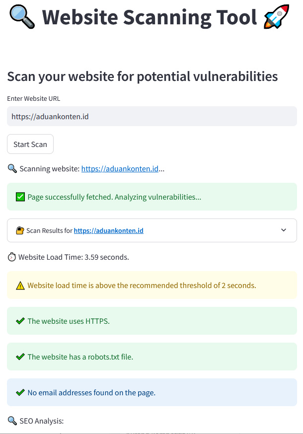

# Website Scanning Tool



## Overview

This tool is designed to scan websites for potential security vulnerabilities and SEO issues. It checks for common security flaws like SQL injection, Cross-Site Scripting (XSS), and missing HTTP headers. Additionally, it performs an SEO analysis and evaluates website load time, HTTPS usage, robots.txt presence, and email addresses on the site.

The tool provides security recommendations based on the scan results and helps developers and website administrators identify areas to improve their site's security and SEO.

## Features

- **SQL Injection Detection**: Detects potential SQL injection vulnerabilities using common payloads.
- **XSS Vulnerability Detection**: Identifies potential Cross-Site Scripting (XSS) vulnerabilities by injecting malicious scripts.
- **HTTP Headers Check**: Scans for missing security headers like HSTS, X-Frame-Options, X-XSS-Protection, and Content-Security-Policy.
- **Security Risk Prediction**: Predicts potential security risks based on the page content, response time, and HTTP headers using a trained decision tree model.
- **SEO Analysis**: Checks for the presence of important meta tags like Title, Description, and Keywords.
- **Email Detection**: Scans for email addresses on the website's pages.
- **URL Discovery**: Finds all links on the webpage and scans them for security vulnerabilities.
- **HTTPS Check**: Ensures the website is using HTTPS.
- **Robots.txt Check**: Verifies if the website has a `robots.txt` file.

## Requirements

- Python 3.x
- Streamlit
- Requests
- BeautifulSoup
- scikit-learn
- NumPy

You can install the required libraries using pip:

```bash
pip install streamlit requests beautifulsoup4 scikit-learn numpy
```

## Usage

1. Launch the tool using Streamlit by running:

    ```bash
    streamlit run app.py
    ```

2. Enter the URL of the website you want to scan in the input field.

3. Click the "Start Scan" button to begin the scanning process.

4. The tool will display the following results:

   - **Security Analysis**:
     - Potential SQL injection and XSS vulnerabilities.
     - Missing HTTP security headers.
     - Suggested security improvements.
     - Predicted security risk based on the content and headers.
   
   - **Performance**:
     - Website load time.
     - HTTPS usage.
     - Robots.txt availability.

   - **SEO Analysis**:
     - Title tag, meta description, and keywords presence.

   - **URL Discovery**:
     - List of URLs found on the website, with security analysis for each URL.

5. The results are displayed in an interactive way using Streamlit components like expandable sections and success/error messages.

## Example Output

- **Security Issues**:
   - 🚨 Potential SQL Injection detected!
   - 🚨 Potential XSS vulnerability detected!
   - ❌ Issues with HTTP headers: Missing HSTS, X-Frame-Options headers.
   - 💡 Recommendations: Add Content-Security-Policy header, enable XSS protection.

- **Performance**:
   - ⏱️ Website Load Time: 1.8 seconds.
   - ✔️ The website uses HTTPS.
   - ⚠️ The website is missing a robots.txt file.

- **SEO**:
   - ✔️ Title tag is present.
   - ⚠️ Meta description is missing.

## Logging

The tool logs all scan activities to a file named `scan_logs.log`. It records the URL being scanned, the status of the scan, and any errors or issues encountered during the process.

## Example Log

```
2025-03-19 12:34:56,789 - INFO - Scanning URL: http://example.com - Status Code: 200
2025-03-19 12:35:00,123 - ERROR - Error testing for SQL Injection: Request timeout
2025-03-19 12:35:01,234 - INFO - Scan completed: http://example.com - SQL Injection: False - XSS: True - Response Time: 1.56s
```

## Contributing

Feel free to contribute to this tool by submitting bug reports or pull requests. If you have any suggestions for improvements, please open an issue in the repository.

## License

This tool is open-source and available under the MIT License. See the `LICENSE` file for more details.